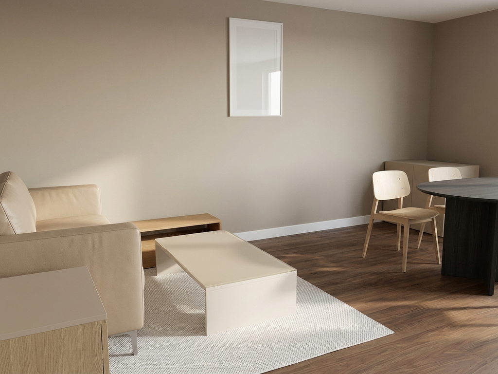
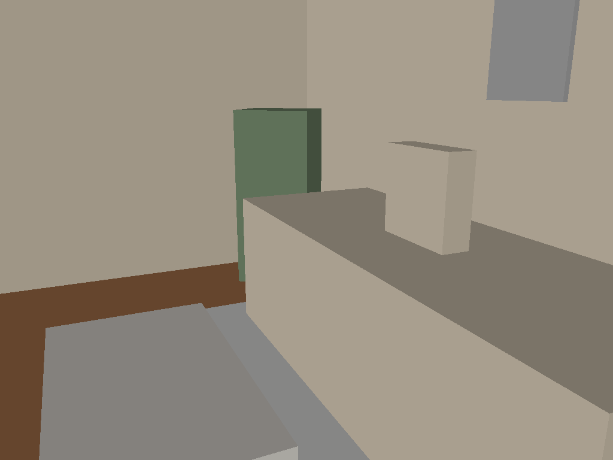
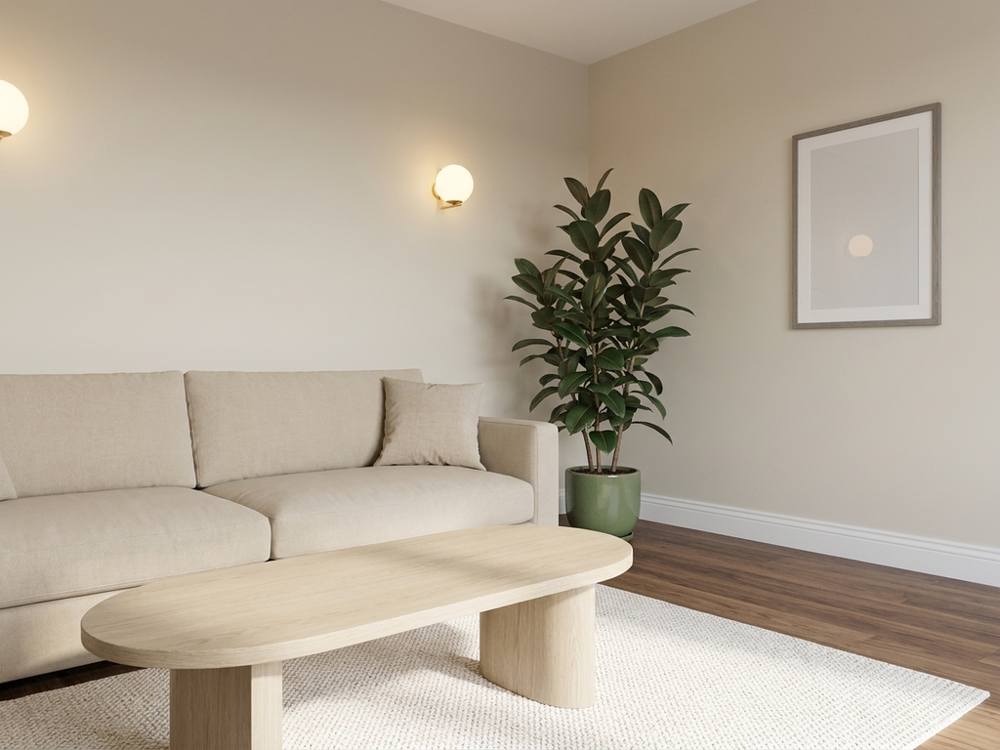
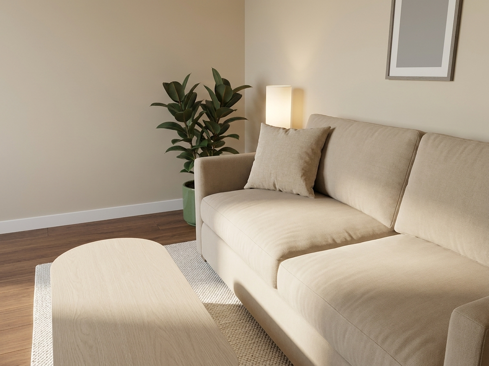
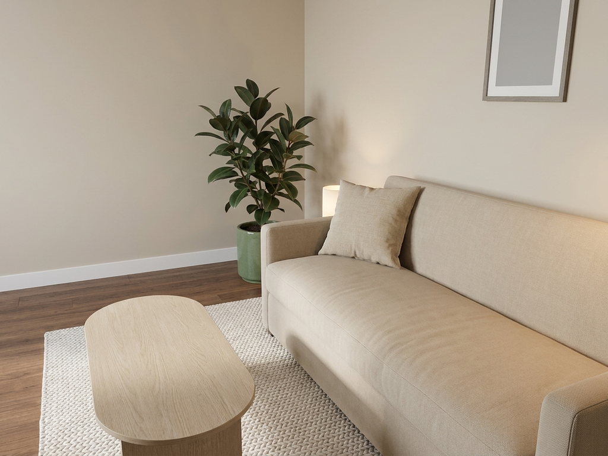
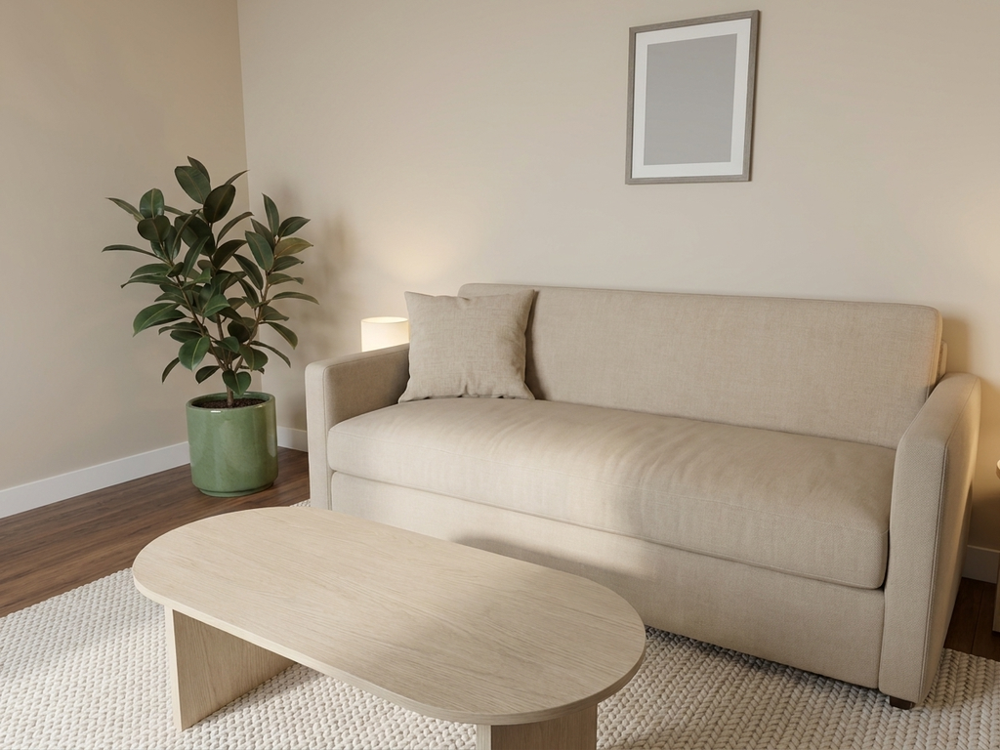

# Floor Plan → Photorealistic Interior Renders

Takes a floor plan (PNG/JPG/PDF), detects the rooms, and generates photorealistic
interior renders from multiple camera angles — furnished exclusively with real
products from a supplier catalog, and returning the exact bill of materials for
every render.



*Generated end-to-end from the assessment PDF: extraction → scale calibration →
catalog-bound design → geometry projection → render → verification. Consistency
score 0.82.*

---

## The hard part

Every requirement in this brief is straightforward except one:

> Every render must represent the exact same interior scene from different camera
> positions. Objects must not move, disappear, appear, rotate, resize, or change
> identity between viewpoints. Only the camera viewpoint may change.

A pipeline that prompts an image model once per viewpoint **cannot** satisfy
this. Diffusion models hold no persistent scene state; every sample re-invents
the room. Prompting harder doesn't fix it — "same room, from the corner" is a
wish, not a constraint.

**So the image model never decides what the room contains.**

A content-hashed 3-D **scene graph** is the single source of truth. Every
object's position, rotation, real-world size, catalog product binding, colour and
per-instance seed is fixed *before a single pixel is generated*. Each render is
that same scene projected through a different camera, conditioned on rasterized
depth and segmentation buffers.

Consistency becomes **structural rather than statistical**.

```
floor plan ──▶ [Claude vision] ──▶ FloorPlan JSON (rooms, walls, openings, metres)
                                          │
catalog ──▶ [adapters] ──▶ product index ─┤
                                          ▼
                          [design agent: retrieve + place]
                                          │
                                          ▼
                            ★ SCENE GRAPH (immutable, hashed) ★
                                          │
                     ┌────────────────────┼────────────────────┐
                     ▼                    ▼                    ▼
                  camera 1             camera 2             camera N
                     │                    │                    │
              [rasterizer: depth + segmentation + wireframe]
                     │                    │                    │
              [Gemini ← geometry + view-1 anchor]
                     │                    │                    │
                  render 1             render 2             render N
                     └────────────────────┼────────────────────┘
                                          ▼
                            [Claude judge → per-view retry]
                                          ▼
                                renders + BOM + consistency scores
```

Three things follow for free: the **BOM is exact** (a graph traversal, not an
inference from the image), **regeneration is reproducible** (same `scene_id` +
seed ⇒ identical conditioning), and **edits are surgical** (a patch; untouched
objects keep their seeds).

---

## Results

Measured by an independent judge — Claude scoring Gemini's output against the
segmentation map projected from the frozen scene graph.

| | score |
|---|---|
| End-to-end run on the supplied floor plan | **0.82** |
| Layout fidelity (best configuration) | **0.72** |
| Object identity | **0.85** |
| **Cross-view consistency** | **0.87** |

### The finding that mattered most

The highest-leverage change was not architectural. Asked to **generate** a room
from geometry maps, Gemini treats them as a mood board. Asked to **re-render an
existing 3-D scene**, it treats them as the thing to preserve.

| | layout fidelity | missing objects |
|---|---|---|
| "Generate a photorealistic room" | 0.12 | 3 of 6 |
| "Re-render this scene, materials and lighting only" | **0.72** | **0** |

<table>
<tr>
<td width="33%"><br><sub><b>The geometry.</b> Both runs got this.</sub></td>
<td width="33%"><br><sub><b>Generation framing — 0.12.</b> Beautiful, wrong room.</sub></td>
<td width="33%"><br><sub><b>Re-render framing — 0.72.</b> Same scene, same seed.</sub></td>
</tr>
</table>

Same scene, same camera, same seed. Full method, numbers and caveats — including
that judge variance is ±0.1 and n=1 per variant — in
[`docs/prompt-iteration.md`](docs/prompt-iteration.md).

### Cross-view consistency

<table>
<tr>
<td width="50%"><br><sub><b>View 1</b> — the anchor.</sub></td>
<td width="50%"><br><sub><b>View 2</b> — same room, different camera. Cross-view 0.87.</sub></td>
</tr>
</table>

Two mechanisms carry consistency, covering different failure modes. **Shared
geometry** fixes layout structurally — it holds whether or not the model
cooperates. **The anchor view** fixes identity: geometry says *where* the sofa
is; only the anchor says it is the *same* sofa, in the same fabric, under the
same light.

---

## Quick start

```bash
make install      # Python 3.12 venv + dependencies
make catalog      # build the product index (288 seeded products)
make run          # API + web UI on http://localhost:8000
make test         # 182 tests
```

Then open <http://localhost:8000>, drop in a floor plan, pick a style, and watch
renders stream in.

```bash
cp .env.example .env    # ANTHROPIC_API_KEY, GEMINI_API_KEY, IMAGE_BACKEND=gemini
```

**Without keys everything still runs.** The catalog, retrieval, BOM, calibration,
solver and rasterizer are fully offline; image generation falls back to a mock
backend that composites the real conditioning maps, and renders are reported as
`verified: false` rather than given a passing score.

The CLI runs the identical pipeline through the same service layer — which is how
the architecture shows it doesn't depend on the UI:

```bash
python cli.py run plan.pdf --page 2 --style scandinavian --views 2
python cli.py catalog --category sofa --style industrial --max-width 2.0
python cli.py styles
```

### Docker

```bash
docker build -t interior-render .
docker run -p 8000:8000 --env-file .env interior-render
```

---

## Design decisions

**The LLM does taste; code does geometry; a different model checks the result.**
Retrieval fills furniture roles from the real catalog — so a product that isn't
in the index cannot appear in a prompt or a BOM. A deterministic solver places
objects against clearances, door swings and published dimensions, because
placement is arithmetic and an LLM asked for coordinates does the thing it is
worst at. Claude then judges Gemini's output: a model grading its own work
excuses its own biases.

**Pixel space and metres never mix.** The vision model is only ever asked for
pixel coordinates plus the `m²` labels printed on the plan — never for real-world
dimensions. Scale comes from a least-squares solve over
`polygon_area_px / scale² = area_label_m²` across every room, which self-checks:
a residual above ~8% means the *extraction* is wrong, not the scale.

**Hard filters run before vector search.** A 2.4 m sofa cannot go in a 2.0 m
slot, and a bathtub is never a near-miss for a sofa however close the embeddings
land. Structured predicates run first in SQL; the embedding only reranks an
already-valid candidate set. Inverting that order is the standard way a RAG
system returns confident nonsense.

**Style tags are derived from material and colour, not assigned.** Pale oak and
linen genuinely reads Scandinavian, Japandi *and* minimalist; black steel does
not. Without that correlation, filtering by style returns an arbitrary slice of
the catalog and style adherence collapses.

**Renovation finishes are products too.** The brief says "every visible furniture
*or renovation* element". Flooring, paint, tile and trim are bound to catalog
products in the scene graph, not left as free-text prompt words.

**Honest reporting over flattering output.** Consistency scores ship in the API
response, including the *worst* view and not just the mean — a mean of 0.85
hiding one view at 0.4 is a broken set. A missing object fails outright however
good the rest looks. Estimated dimensions are flagged in the BOM. Furniture that
no catalog product could satisfy, and objects the solver could not place, are
reported rather than faked. Running without a judge reports `verified: false`,
never a score.

Full rationale, and what was **rejected**, in
[`docs/ARCHITECTURE.md`](docs/ARCHITECTURE.md).

---

## Architecture

```
backend/
  config.py               all tunables — model IDs, solver constants, thresholds
  schemas/                the contracts between every stage
    common.py             Vec2/Vec3/Size3 + polygon geometry
    floorplan.py          extraction (pixel space) → calibrated FloorPlan (metres)
    product.py            Product, 40+ categories, ProductQuery, BOM
    scene.py            ★ the scene graph — content-hashed, immutable
    render.py             conditioning maps, consistency scores, jobs
  catalog/                adapters → normalize → SQLite index → hybrid retrieval
  ingest/                 loader → two-pass vision extraction → m² calibration
  design/                 room programs → catalog selection → placement solver
  render/                 camera rig → numpy pinhole rasterizer → conditioning maps
  imagegen/               prompt assembly → ImageBackend (Mock/Gemini) → anchoring
  verify/                 Claude judge → per-view retry → honest summary
  services/               pipeline + in-process stores + thread pool
  api/                    FastAPI routers (catalog, floorplans, designs, SSE)
frontend/                 vanilla JS — no build step
cli.py                    same pipeline, no web server
docs/                     ARCHITECTURE.md, prompt-iteration.md, samples/
```

### API

```
POST /floorplans                    upload → extracted rooms + calibration
GET  /floorplans/{id}               full geometry
GET  /styles                        12 styles × 25 palettes
POST /designs                       queue a job
GET  /designs/{id}                  status, renders, scores
GET  /designs/{id}/stream           SSE progress, per view as it lands
GET  /designs/{id}/bom              products, quantities, total cost
POST /designs/{id}/regenerate       same scene, new seeds
GET  /catalog/search                category · dims · colour · material · style · price
POST /catalog/reindex               re-import every supplier feed
```

Interactive docs at `/docs`.

---

## Catalog

The assessment names **Gorgia** (renovation, lighting, flooring, paint, bath and
kitchen) and **Comforter** (sofas, tables, beds, wardrobes, textiles) as sources
but ships no data files or API.

This repo therefore includes a **deterministically generated stand-in catalog** of
288 products spanning both suppliers' stated ranges, emitted in *raw supplier
shape* — dimensions as free text, prices as formatted strings, colour implied by
the title — so the import path exercises the real adapters and parsers rather
than bypassing them. If the parsers regress, the catalog build breaks.

Adding a supplier means dropping `{supplier}_products.json` into `data/catalog/`
and calling `POST /catalog/reindex`. A dedicated adapter is optional; the generic
one handles unknown feeds.

---

## Running on AWS

Only the Claude half ports. Gemini is a Google model and is not on Bedrock — its
cloud home is Vertex AI. Claude runs on Bedrock (`anthropic.claude-opus-5`) or,
better, on **Claude Platform on AWS** (Anthropic-operated, same-day parity, bare
model IDs); everything this project uses is supported there.

For images on AWS the option is **Amazon Nova Canvas**, which takes a
segmentation map as a first-class control signal — a closer fit to this
architecture than Gemini. It was the front-runner when measured layout fidelity
was 0.12; re-framing the task moved that to 0.72 and removed the urgency.
`NovaCanvasBackend` would slot into `ImageBackend` unchanged.

---

## Known gaps

Stated plainly rather than implied:

- **The LLM slot proposer is not built.** Room programs are rule-based — good
  interior-design practice, hand-written. The interface is designed for a model
  to refine them; nothing calls one.
- **Natural-language edits are not built.** `/regenerate` re-renders the same
  scene graph with new seeds. The scene-graph patch path returns `501` rather
  than silently doing a full re-design.
- **The catalog has no product photography.** Real product photos are the
  strongest signal for holding object identity across viewpoints; with a real
  catalog this pipeline would be measurably more consistent than it is here.
- **Small objects still drift.** Layout fidelity of 0.72 is a large improvement,
  not fidelity. The judge's remaining complaints are consistently about cushions,
  rug extents and a coffee table shifted a few percent. Large objects land
  correctly. Occasionally an untextured placeholder block survives into the
  output.
- **Persistence is in-process.** Fine for a demo and the CLI; the swap touches
  `services/store.py` only.
- **Evaluation is thin.** n=1 per prompt variant, one scene, one room type. Judge
  variance is ±0.1.

## On the time estimate

The brief estimates 2–3 hours. That is not achievable for these requirements:
anything built in three hours is a per-view prompting loop, which fails the
scene-consistency section outright — as the 0.12 baseline here demonstrates
empirically. This took considerably longer, and the extra time went into the
scene graph, the solver, the rasterizer and the verification loop, which are the
parts that make the consistency requirement satisfiable at all.

## Stack

Python 3.12, FastAPI, Pydantic v2, SQLite, numpy, PyMuPDF, Pillow. Claude Opus 5
for vision extraction and judging, Gemini 3 Pro Image for generation. Vanilla JS
frontend, no build step. No GPU required.

## Licence

[MIT](LICENSE)
